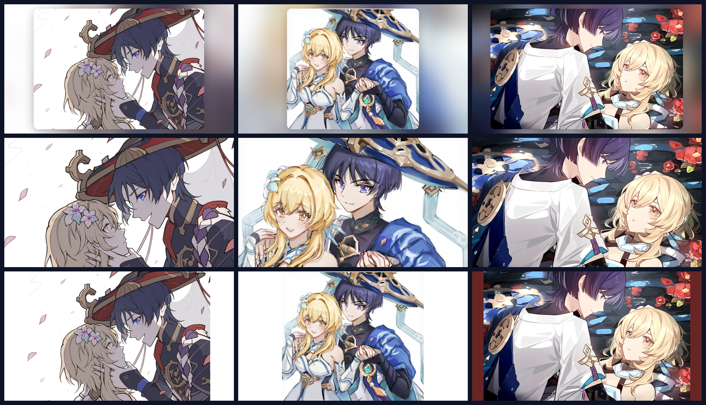

# 💙 原神 CP 壁纸套件 20 · 散兵 × 荧

**三张素材 × 三种摆法 = 9 种壁纸**一键切换 / 可视化切换器 / 桌面桌宠 /
多 IDE 皮肤 / DeepKing 界面皮肤。素材内置于发行包, **离线可用**;
跨平台 Windows / macOS / Linux。



## ✨ 三张素材

| 序号 | 名称 | 画面 | 原始比例 |
|---|---|---|---|
| 1 | 触碰 | 留白花瓣中的对望: 散兵俯身托起荧的下巴, 两人侧脸相对 | 1.4143 |
| 2 | 依偎 | 浅色底双人合影: 荧戴白花冠笑着看镜头, 散兵在她身侧微笑 | 1.0979 |
| 3 | 水畔 | 水畔夜色: 散兵着白衬衫俯身, 荧仰头望着他, 背景深墨蓝水面与朱红落花 | 1.6004 |

## ✨ 三种摆法

每张素材都能在三种摆放方式之间切换, 所以共 **9 种壁纸**:

| 模式 id | 名称 | 效果 | 适合 |
|---|---|---|---|
| `single1..3` | **卡片式**(默认) | 模糊填充背景 + 居中圆角卡片, 构图完整不裁切 | 通用; 图标不被压住 |
| `cover1..3` | 满屏 | cover 铺满整屏, 无边框 | 想要沉浸感, 无边框 |
| `showall1..3` | 完整 | 等比放进同色纯色底, **一个像素都不裁** | 一点画面都不想丢 |

> 三张都窄于 16:9, 满屏时**横向零裁切**、只裁上下。其中第 2 张最窄(1.0979),
> 取景窗只占源高 **62%**, 纵向余量 457px —— 取景窗上移到 0.34 才同时保住两人的脸。

## 🚀 给 AI 一句话安装

把本仓库链接发给**任意 AI**(DeepKing、Claude Code、Kimi Code、CodeX、Trae、Cursor、
JetBrains AI、DSH Harness 等), 它会读 [`AGENTS.md`](AGENTS.md) 替你装完:

```text
请安装 https://github.com/WPH666-py/Genshen-skin-CP20 的原神CP20壁纸
```

## 🖥️ 手动安装

要求: Python 3.9+。Pillow 缺失时脚本会自动 `pip install`。

```bash
# 方式一: 用仓库里已打包好的 wheel(离线可用)
pip install dist/genshen_skin_cp20-0.1.0-py3-none-any.whl
genshen-cp20-install         # 一键: 生成壁纸 + 设为桌面 + 注册已装 IDE

# 方式二: 源码
git clone https://github.com/WPH666-py/Genshen-skin-CP20.git
cd Genshen-skin-CP20
python -m genshen_skin_cp20.engine.autoinstall
```

Windows 用户也可以直接双击 `install.bat`。

## 🎨 常用命令

```bash
genshen-cp20               # 第 1 张 · 卡片式(默认)
genshen-cp20 2             # 第 2 张(依偎)
genshen-cp20 3             # 第 3 张(水畔)
genshen-cp20 cover         # 第 1 张满屏
genshen-cp20 cover2        # 第 2 张满屏
genshen-cp20 showall3      # 第 3 张完整不裁
genshen-cp20 random        # 随机一张(9 种里随机)
genshen-cp20 list          # 列出全部 9 种模式
genshen-cp20 switcher      # 可视化切换器(预览 + 一键应用 + 自动随机)
genshen-cp20 pet           # 桌面桌宠(拖动 / 右键换立绘 / Esc 退出)
genshen-cp20 cycle 30      # 每 30 分钟自动随机换
genshen-cp20 all --out DIR # 一次生成 9 张到指定目录
genshen-cp20 deepking      # 生成 DeepKing 界面皮肤 + 离线预览
genshen-cp20 info          # 环境与素材自检
```

常用选项: `--size 2560x1440` 指定分辨率(默认取屏幕分辨率)、`--no-set` 只生成不设置。

## 🧩 IDE / 桌宠支持

| 环境 | 接入方式 |
|---|---|
| **VSCode / Trae / CodeX / Cursor / Windsurf** | 活动栏「原神CP20」→ 皮肤画廊 9 张卡片一键换; 命令面板搜 `原神CP20` |
| **DeepKing** | 设置 → 界面皮肤 → 粘贴本仓库地址, 自动生成深靛紫配色皮肤 |
| **PyCharm / WebStorm / IntelliJ** | Settings → Appearance & Behavior → Appearance → **Background Image** |
| **Claude Code / Kimi Code / Harness 等** | 注册 MCP 服务器, AI 直接调 `set_wallpaper` / `next_wallpaper` |
| **桌面桌宠** | `genshen-cp20 pet` —— 透明置顶圆形立绘, 可拖动、右键菜单 |

一键注册全部已装 IDE:

```bash
genshen-cp20-install --only vscode jetbrains mcp deepking
```

## 📁 目录

```
src/genshen_skin_cp20/
  characters/cp20_pair.py   角色与素材定义(换角色只改这一个文件)
  engine/                   皮肤引擎: 合成 / 壁纸设置 / CLI / 桌宠 / 切换器 /
                            MCP 服务器 / DeepKing 适配 / 自动安装
  deepking_skin.py          手工校色的 DeepKing 调色板(32 槽位)
src/client/                 DeepKing 配色变量 + 维护说明
vscode/                     VSCode/Trae/CodeX 扩展(含打包好的 .vsix)
ide/jetbrains/              JetBrains 背景图指引
tools/                      维护脚本(推送 / 引擎同步 / 线上契约校验)
AGENTS.md                   给 AI 的自动安装指引
```

## ❓ 常见问题

- **想加第 4 张**: 把图放进 `src/genshen_skin_cp20/engine/assets/`, 在
  `characters/cp20_pair.py` 的 `IMAGE_FILES` 追加文件名、`IMAGE_META` 补一条说明
  —— 模式列表会自动从 9 种变成 12 种。
- **壁纸尺寸**: 默认取主屏分辨率; 多显示器建议加 `--size 2560x1440`。
- **命令找不到**: Scripts 目录不在 PATH, 改用 `python -m genshen_skin_cp20.engine.cli`。
- **桌宠不透明**: 个别 Linux 桌面不支持透明色键, 会退化为白底卡片, 功能不受影响。

## 🔗 与其它套件的关系

与 WPH666-py 的其它皮肤套件**完全独立**: 包名 `genshen-skin-cp20`、
命令前缀 `genshen-cp20`、运行时目录 `~/.genshen-cp20`、
vscode 扩展 ID `wp666.genshen-skin-cp20`、
DeepKing 皮肤 id `genshen-cp20-scaramouche-lumine`
互不冲突, 各套件可同时安装。引擎与其它套件共用同一套实现。

## 🙏 素材说明

3 张散兵 × 荧同人插画。**仅用于个人桌面美化, 请勿二次商用。**
版权归原作者所有。

## 📄 许可

代码以 MIT 许可发布(见 [LICENSE](LICENSE)); 插画素材不在 MIT 授权范围内。
